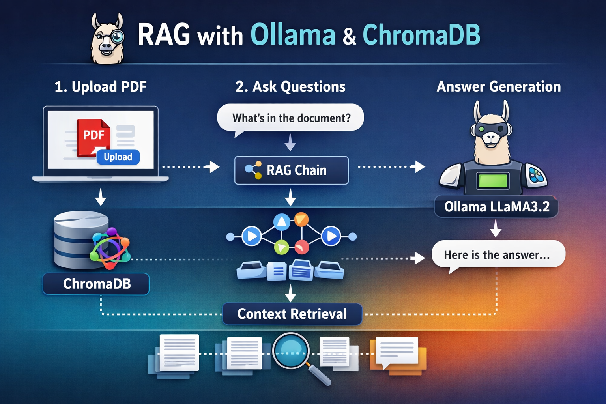

# 📄 RAG Project with Ollama & ChromaDB
## RAG Architecture
## RAG System Architecture



A simple **Retrieval-Augmented Generation (RAG)** application that allows users to upload a PDF document and ask questions about its content.

The application uses:

* **Streamlit** for the user interface
* **Ollama (LLaMA3.2)** as the local Large Language Model
* **ChromaDB** as the vector database
* **LangChain** for building the RAG pipeline

Everything runs **locally**, so no external API keys are required.

---

## 🚀 Features

* Upload a **PDF document**
* Automatically **process and chunk the document**
* Store embeddings in **ChromaDB**
* Ask **natural language questions**
* Retrieve **relevant context from the PDF**
* Generate answers using **Ollama LLM**
* View the **context used for the answer**

---

## 🏗️ Project Structure

```
RAG-PROJECT/
│
├── main.py
├── supporting_functions.py
├── requirements.txt
├── README.md
└── temp_docs/
```

**main.py**
Contains the Streamlit application UI.

**supporting_functions.py**
Handles:

* Vector store creation
* Embedding generation
* RAG chain creation

**temp_docs/**
Temporarily stores uploaded PDF files.

---

## ⚙️ Installation

### 1️⃣ Clone the repository
https://github.com/roman-2024/RAG-with-ollama-and-chromaDB

### 2️⃣ Create a virtual environment

```bash
python -m venv venv
```

Activate it:

Windows

```bash
venv\Scripts\activate
```

Linux / Mac

```bash
source venv/bin/activate
```

### 3️⃣ Install dependencies

```bash
pip install -r requirements.txt
```

---

## 🧠 Install and Run Ollama

Install Ollama from:

https://ollama.com

Then pull the model:

```bash
ollama pull llama3.2
```

Make sure Ollama is running locally.

---

## ▶️ Run the Application

Start the Streamlit app:

```bash
streamlit run main.py
```

The application will open in your browser.

---

## 🧪 How to Use

1. Open the application
2. Upload a **PDF document**
3. Click **Process**
4. Ask questions related to the document
5. The system will:

   * Retrieve relevant chunks from the PDF
   * Send them to the LLM
   * Generate a contextual answer

You can also expand the **Context** section to see the retrieved document parts.

---

## 🧩 Tech Stack

* **Python**
* **Streamlit**
* **LangChain**
* **Ollama**
* **ChromaDB**

---

## 📌 Example Workflow

```
PDF → Text Chunking → Embeddings → ChromaDB
                         ↓
                     Retriever
                         ↓
                Context + Question
                         ↓
                      Ollama
                         ↓
                      Answer
```

---

## 🔮 Future Improvements

* Multi-PDF support
* Chat history memory
* Better chunking strategies
* Hybrid search (BM25 + embeddings)
* Support for different LLMs

---

## 📜 License

This project is open-source and available under the **MIT License**.

---

## 👨‍💻 Author

Roman Ahmed,
Data Science & Machine Learning Enthusiast
